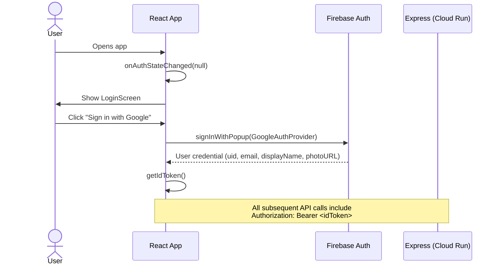
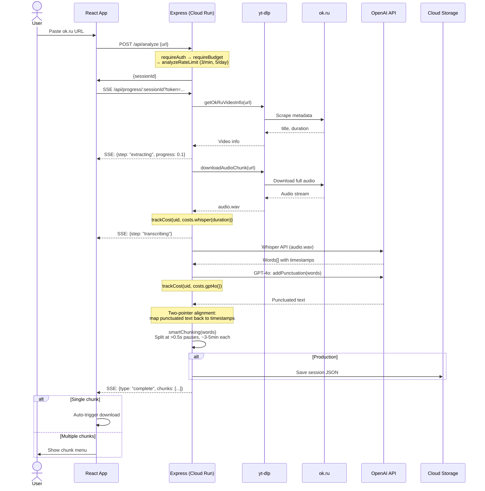
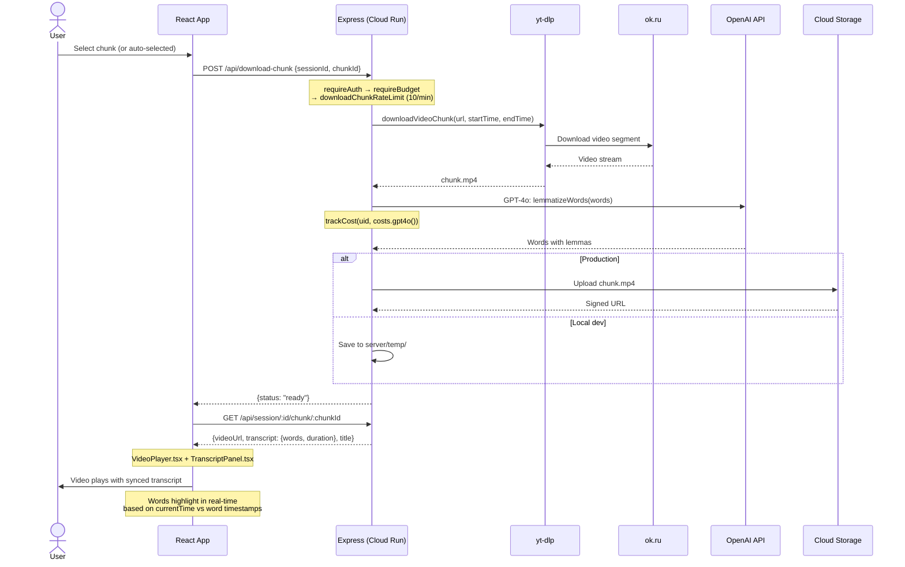
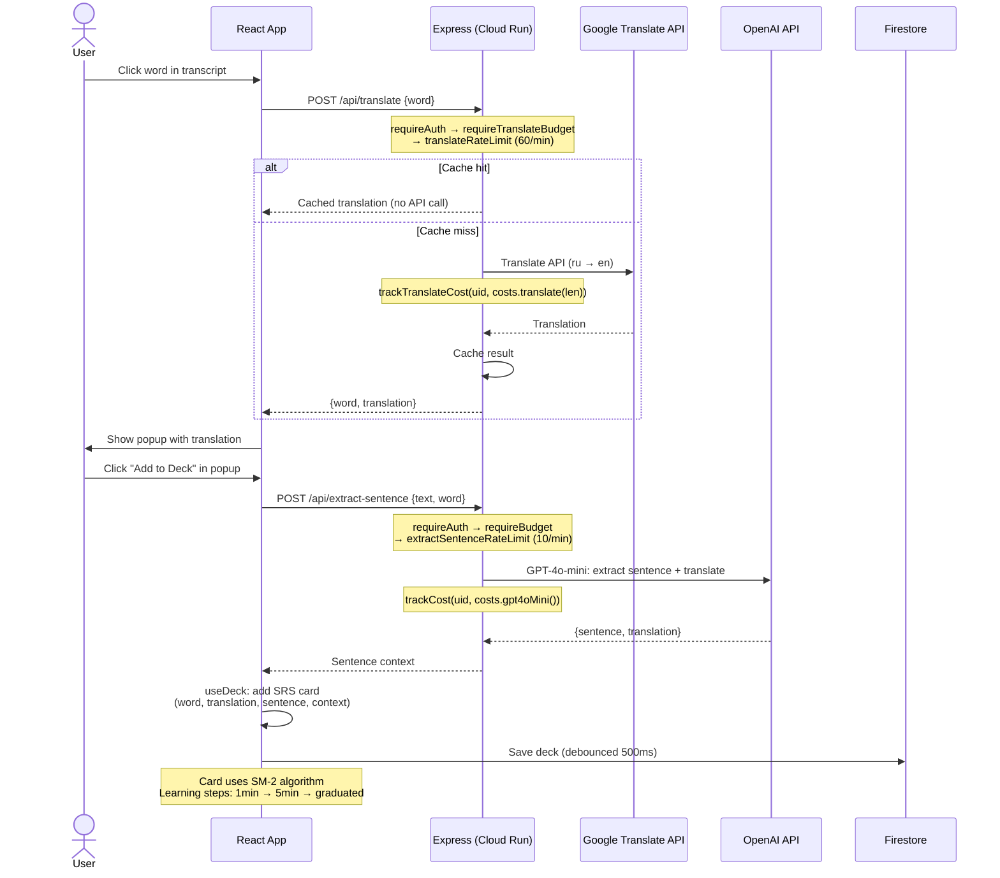
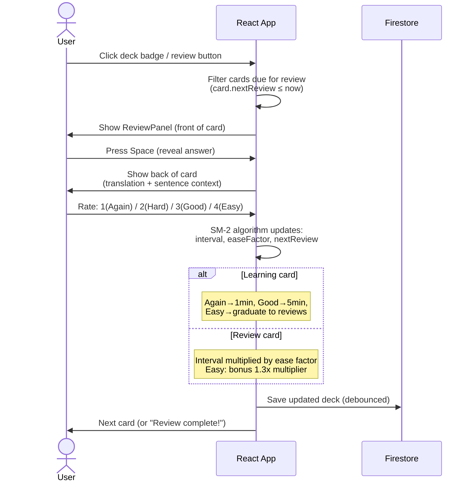
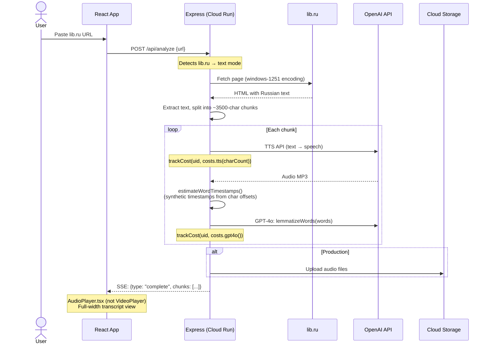
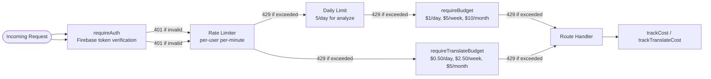

# System Architecture — Data Flow

## 1. Authentication



## 2. Video Analysis (ok.ru)



## 3. Chunk Download & Playback



## 4. Word Translation & Flashcards



## 5. Flashcard Review



## 6. Text Mode (lib.ru)



## 7. Rate Limiting & Cost Control Pipeline



## Infrastructure

```
┌─────────────────────────────────────────────────────────┐
│                    Cloud Run (us-central1)               │
│  ┌─────────────────────────────────────────────────────┐ │
│  │  Docker Container                                   │ │
│  │  ┌──────────┐  ┌──────────┐  ┌────────┐  ┌──────┐ │ │
│  │  │ Express  │  │ yt-dlp   │  │ ffmpeg │  │ dist/│ │ │
│  │  │ server   │  │          │  │        │  │(React)│ │ │
│  │  └──────────┘  └──────────┘  └────────┘  └──────┘ │ │
│  └─────────────────────────────────────────────────────┘ │
└─────────────┬───────────┬──────────────┬────────────────┘
              │           │              │
    ┌─────────▼──┐  ┌─────▼─────┐  ┌────▼──────┐
    │ Cloud      │  │ Secret    │  │ Firestore │
    │ Storage    │  │ Manager   │  │ (decks)   │
    │ (videos,   │  │ (API keys)│  │           │
    │  sessions) │  │           │  │           │
    └────────────┘  └───────────┘  └───────────┘

External APIs:
  ├── OpenAI (Whisper, GPT-4o, GPT-4o-mini, TTS)
  ├── Google Translate
  ├── ok.ru (video source)
  └── lib.ru (text source)
```
